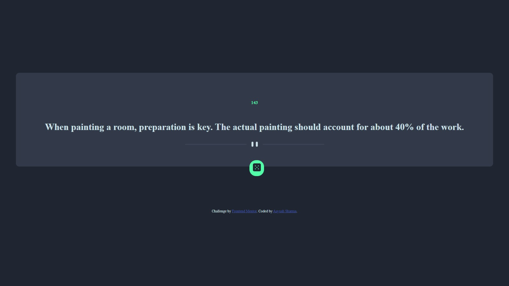

# Frontend Mentor - Advice generator app solution

This is a solution to the [Advice generator app challenge on Frontend Mentor](https://www.frontendmentor.io/challenges/advice-generator-app-QdUG-13db). Frontend Mentor challenges help you improve your coding skills by building realistic projects.

## Table of contents

- [Overview](#overview)
  - [The challenge](#the-challenge)
  - [Screenshot](#screenshot)
  - [Links](#links)

  - [Built with](#built-with)
  - [What I learned](#what-i-learned)
  - [Continued development](#continued-development)
  - [Useful resources](#useful-resources)
- [Author](#author)

**Note: Delete this note and update the table of contents based on what sections you keep.**

## Overview

### The challenge

Users should be able to:

- View the optimal layout for the app depending on their device's screen size
- See hover states for all interactive elements on the page
- Generate a new piece of advice by clicking the dice icon

### Screenshot

### Links

- Solution URL: [Add solution URL here](https://your-solution-url.com)
- Live Site URL: [Add live site URL here](https://aayush987.github.io/Advice-Generator-App/)

### Built with

- Semantic HTML5 markup
- CSS custom properties
- Fetch Api Method

### What I learned

I learned a very important part of web development- How to work with 3rd party Api's using Fetch method in Javascript.

### Continued development

I will continue learning about promises,async, await and fetch methods in javascript.

### Useful resources

- [Example resource 1](https://www.youtube.com/watch?v=zUcc4vW-jsI) - This helped me to understand how to display contents of api on webpage.

## Author

- Website - [Aayush Sharma](https://aayush987.github.io/Portfolio-Website/)
- Frontend Mentor - [@Aayush987](https://www.frontendmentor.io/profile/Aayush987)
- Twitter - [@Aayush47163](https://www.twitter.com/Aayush47163)

